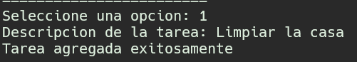
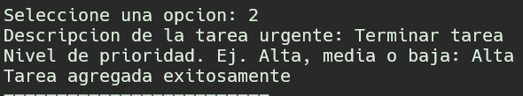
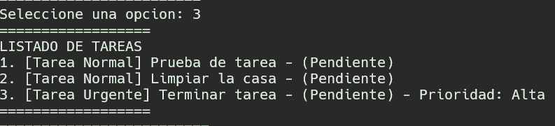
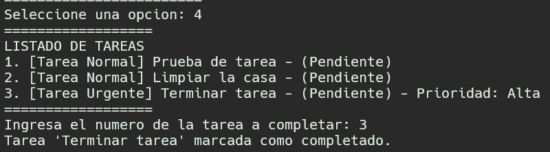
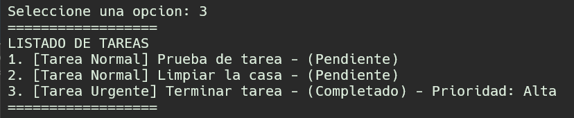
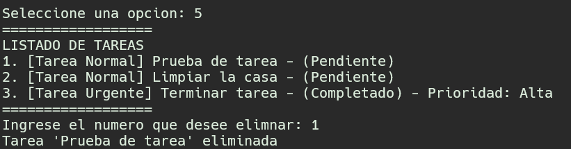
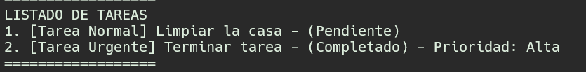
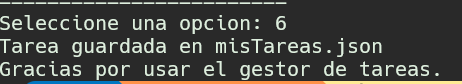

# Proyecto: Sistema de Gestión de Tareas (POO)

Este proyecto es un sistema de gestión de tareas por consola desarrollado en Python. Es una actividad diseñada para aplicar y consolidar los cuatro pilares fundamentales de la Programación Orientada a Objetos: Encapsulación, Herencia, Polimorfismo y Abstracción.

## Características

- Crear tareas normales.
- Crear tareas urgentes con un nivel de prioridad.
- Listar todas las tareas, mostrando su tipo y estado.
- Marcar tareas como "Completadas".
- Eliminar tareas de la lista.
- Persistencia de datos: las tareas se guardan en un archivo `misTareas.json` y se cargan al iniciar el programa.

## Instrucciones de Ejecución

1.  Asegúrate de tener Python 3 instalado.
2.  Clona este repositorio en tu máquina local:
    ```bash
    git clone [https://github.com/tu-usuario/tu-repositorio.git](https://github.com/tu-usuario/tu-repositorio.git)
    ```
3.  Navega hasta la carpeta del proyecto que acabas de clonar:
    ```bash
    cd tu-repositorio
    ```
4.  Ejecuta el script principal:
    ```bash
    python main.py
    ```

## Explicación del Diseño (Principios POO)

El diseño del sistema se basa en los siguientes principios de la POO:

### 1. Clases y Abstracción

- **`Tarea`**: Es la clase base. Abstrae el concepto de una tarea, conteniendo solo la información esencial que toda tarea debe tener: una `_descripcion` y un estado `_completada`.
- **`GestorTareas`**: Esta clase abstrae toda la lógica de manejo del inventario. El usuario principal (el menú) no sabe _cómo_ se guardan las tareas, solo le pide al gestor que "agregue" o "liste".

### 2. Encapsulación

Los atributos principales de los objetos están protegidos para evitar su modificación directa.

- En `Tarea`, los atributos `_descripcion` y `_completada` son protegidos (usando `_`).
- Para cambiar el estado, se debe usar el método público `marcar_completada()`. Esto asegura que el estado solo se pueda modificar de una manera controlada.
- En `GestorTareas`, la lista `_tareas` también está protegida. La interacción se realiza a través de métodos públicos como `agregarTarea()` y `eliminarTarea()`.

### 3. Herencia

La herencia se utiliza para crear especializaciones de una tarea.

- La clase `TareaUrgente` **hereda** de `Tarea`.
- Esto significa que `TareaUrgente` obtiene automáticamente todos los atributos y métodos de `Tarea` (como `_descripcion` y `marcarCompletada()`) sin necesidad de reescribirlos.
- `TareaUrgente` **extiende** la funcionalidad de su padre añadiendo un nuevo atributo: `_prioridad`.

### 4. Polimorfismo

El polimorfismo se demuestra de manera clave en el método `listarTareas()` del `GestorTareas`.

- El gestor tiene una única lista, `self._tareas`, que contiene objetos de _diferentes tipos_ (`Tarea` y `TareaUrgente`).
- Cuando el gestor recorre la lista, simplemente llama a `tarea.mostrarInfo()` en cada objeto.
- Python, gracias al polimorfismo, ejecuta automáticamente la versión **correcta** del método:
  - Si el objeto es una `Tarea`, ejecuta `Tarea.mostrarInfo()`.
  - Si el objeto es una `TareaUrgente`, ejecuta `TareaUrgente.mostrarInfo()`.
- Esto permite que el código del gestor sea simple y no necesite comprobar el tipo de cada tarea con `if`s, lo cual es la principal ventaja del polimorfismo.

### 5. Persistencia (Serialización)

Para guardar los objetos en un archivo JSON, no podemos simplemente guardar el objeto en sí.

1.  **Serialización (Guardar)**: Cada clase (`Tarea` y `TareaUrgente`) tiene un método `toDict()`. Este método convierte el objeto en un diccionario, un formato que JSON sí entiende. Es crucial que guardemos un campo `"tipo"` para saber qué clase era.
2.  **Deserialización (Cargar)**: El método `cargarJson()` lee el archivo JSON. Luego, recorre la lista de diccionarios y, usando el campo `"tipo"`, decide si debe crear un nuevo objeto `Tarea` o `TareaUrgente`, restaurando así el estado del programa.

## Demostración de Ejecución

Aquí se muestra el funcionamiento del menú interactivo y la gestión de tareas.

**Menú Principal:**


**Agregar tarea:**


**Agregar tarea urgente:**


**Listado de Tareas:**


**Marcar tarea como completada:**


**Verificacion de completado de tarea:**


**Eliminar tarea:**


**Verificacion de Eliminar tarea:**


**Guardar y salir:**

